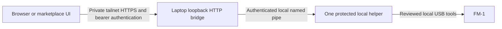

# FM-1 remote debug reference

This document describes the reviewed FM-1 laptop bridge as a reference for the
marketplace integration. The bridge is an authenticated HTTP/JSON service; it
is not itself an MCP or WebMCP server. A marketplace adapter should expose its
fixed operations without taking ownership of USB flashing or bypassing the
local protected helper.

## Architecture and prerequisites



The Windows laptop owns the physical USB connection. The bridge runs
unelevated and binds to `127.0.0.1:9770`; Tailscale Serve supplies private HTTPS.
The protected helper validates device identity, scope, candidate bytes and
baseline before permitting a write. Keep one active writer for the device and
one owner of the bridge's durable state. The bridge process lock is per state
directory; a new state directory is not permission to start a parallel writer
or bypass uncertainty. A browser disconnect does not cancel the laptop job.

The public snapshot includes bridge, UI and local pipe-client reference source.
It does not include the protected worker, protected-helper launcher, vendor USB
tools, loader or private baseline. It cannot create a protected helper by
itself. Those are separately reviewed trusted bench prerequisites; connect the
bridge only to a helper established through that local workflow.

Prerequisites are:

- The existing Python 3.11 runtime required by the protected launcher, with the
  versions pinned in `requirements-remote.txt`. A separately selected bridge
  interpreter does not change the protected helper's interpreter requirement.
- A locally created, immutable helper snapshot and its runtime/ownership guards.
  The launcher validates the existing runtime and freezes reviewed code and
  dependencies. It does not install Python or weaken permissions. Local helper
  creation uses the existing OS elevation flow; the remote adapter cannot grant
  elevation or choose arbitrary executable paths.
- A verified full-image baseline and matching deployment receipt belonging to
  the same physical FM-1. An old verified image is insufficient after an
  interrupted write or a change to the device's contents.
- Tailscale HTTPS configured for the intended users and laptop, plus the bridge's
  bearer credential. Private Serve access and bearer authentication are separate
  requirements. Public Funnel publication is outside this workflow.

The static store page is public to its configured listener; every `/v1/` API
endpoint requires `Authorization: Bearer <credential>`. Credentials remain in
private laptop state. The existing store keeps the entered credential in page
memory; reload requires reconnecting. An adapter must not put it in URLs,
catalog data, tool results, transcripts or newly persistent browser storage.

### Browser and MCP boundaries

The current bridge has no CORS or `OPTIONS` support. Do not assume that an
unrelated hosted page can fetch its private API. A top-level WebMCP integration
can use a same-origin bridge page, or a separately authorized adapter can make
server-side requests through a trusted network path. A cloud runtime's ability
to reach the laptop's tailnet must be established separately.

The existing store sends a `frame-ancestors 'none'` policy. An MCP panel should
provide its own UI resource and wrap narrow adapter tools rather than iframe the
store. Neither MCP nor WebMCP changes the local helper's permissions or the
approval needed for a device operation.

## Catalog and selection

Each catalog entry is an immutable, validated packaged firmware variant, with
an ID, app profile, title, description, variant label and image digest. The
current profiles are NES, Doom, MDX, Buddha and ProTracker. Reusing an ID for
different bytes is refused; a changed package needs a new ID.

Local validation checks the complete package and candidate digest. Preparing a
package against the current verified baseline is permitted only when its
boot/configuration/reserved regions match that unit. This is not a mechanism
for grafting another device's image onto the current FM-1. The protected writer
revalidates the request and flash scope. Catalog `ready` means preserved-byte
compatibility; the engine and helper can still be blocked or require recovery.

Show the human-readable title together with the variant label and digest in
selection and approval UI. The reference MDX card prefers the RayForce variant
when that validated package is available, while retaining the original demo as
a separate choice. This selection preference does not imply that RayForce is
currently installed. A private MDX build embeds both its sequence and required
PDX sample bank in the app; the reference document and public plugin contain
neither those assets nor device images.

Catalog upload is a local catalog mutation, not a firmware write. Do not treat
successful upload, a ready card, or a completed offline plan as permission to
flash. Package export/build validation belongs to the producer workflow, and
physical screen, audio and keyboard acceptance remains a separate bench check.

## Adapter API contract

Use the actual bridge API rather than inventing shell commands or a second
writer. JSON responses use `{ "ok": true, "data": ... }`; rejected requests
use the corresponding error envelope and HTTP status. `POST /v1/jobs` returns
HTTP 202 with the accepted or previously saved job. HTTP success and the outer
`ok` flag describe request handling, not firmware completion: a successful GET
can return a failed job. Inspect `data.status` and its terminal result.

| API | Purpose and boundary |
|---|---|
| `GET /v1/status` | Bridge engine state and laptop inventory/session summary; it does not flash or reset the device. |
| `GET /v1/catalog` | Validated catalog metadata and readiness for the current baseline. |
| `POST /v1/catalog` | Validate/install a packaged variant in the private local catalog, HTTP 201; no device write. |
| `POST /v1/jobs` | Submit one fixed operation with a caller-generated durable ID. |
| `GET /v1/jobs/<id>` | Poll the existing job and verified progress without resubmission. |
| `GET /v1/jobs/<id>/firmware` | Download the verified result of a successful firmware-read job. |
| `GET /v1/baseline` | Download the selected verified baseline; its contents remain private. |

Job IDs are 32 lowercase hexadecimal characters. Save the ID and exact intended
request before sending the POST. The two catalog operations have these fields:

```json
{
  "id": "<32-lowercase-hex-id>",
  "operation": "plan_app",
  "catalog_id": "<validated-variant-id>"
}
```

```json
{
  "id": "<32-lowercase-hex-id>",
  "operation": "switch_app",
  "catalog_id": "<validated-variant-id>",
  "entry_method": "serial"
}
```

`plan_app` performs local/offline planning without device I/O. `switch_app`
requires the entry method `serial` or `already_uboot`; the latter verifies that
the device is already enumerated in UBOOT. Select the method deliberately.
Unexpected fields are rejected. The adapter should not add raw device paths,
executables, arbitrary shell text or unreviewed image requests.

The engine also recognizes `plan`, `flash`, `retry_flash`, `recover_flash`,
`reset`, `observe`, `enter_uboot`, `read_firmware`, `serial_status`, `environment`
and `official_updater`. These are fixed local operations, not arbitrary remote
execution. For a marketplace integration, begin with metadata, `plan_app`,
saved-job polling and an explicitly approved `switch_app`. Keep low-level
recovery and helper management in the trusted local workflow. `serial_status`,
`observe` and `read_firmware` are not metadata-only calls: they access the device,
and observation/read operations can affect session state even though they do
not flash an app. `read_firmware` requires `loader_state` of `cold` or `reuse`;
cold loader initialization can alter NOR protection/status registers and leaves
a helper running. Establish cold UBOOT locally before a later flash. The
official updater is a configured, hash-checked vendor application handoff, not
another implementation of its writer. Successful handoff does not prove that
firmware was installed; protected operations remain blocked pending a verified
baseline and a fresh protected session.

### Approval and durable jobs

A device-changing request needs explicit user authorization for the concrete
operation and selected variant. Browsing a catalog or asking about missing
assets is not authorization to flash. Present the variant title, digest, entry
method and intended write/restart before submission. This is adapter/UI policy:
bearer authentication does not enforce per-write consent, and the bridge has
no `confirmed` or `consent` request field. Keep approval metadata outside its
strict JSON body. Read-only metadata and offline planning should remain clearly
separate from that approval.

Submitting an identical normalized request under the same ID returns the
existing job; a changed request under that ID is a conflict. This idempotency is
not an instruction to retry POST after a timeout. If the response is lost, poll
`GET /v1/jobs/<saved-id>`. Never generate a new ID to repeat a possibly running
write. If the result is unknown, preserve it and request local inspection.

The engine serializes jobs, persists requests/results, and retains an
uncertainty latch across bridge restarts. Restarting a bridge or opening a new
browser must not clear that latch or discard job history. Preserve the state
directory and credentials, verify that the engine is idle, and use the supported
local restart procedure when deploying adapter or frontend changes.

## Write completion and progress

A normal `switch_app` performs offline planning, a known serial UBOOT entry
when needed, scoped changed-sector writes with sector verification, one full
image readback, one reset, startup observation, and an actual firmware profile
check. A reset disconnect is not a reason to issue an extra reset. Success
depends on the real HELLO/profile identifier, not the app card title.

| App profile | Expected firmware identifier |
|---|---|
| NES | `NES` |
| Doom | `DOOM-FM1/1` |
| MDX | `MDX-KARAOKE/1` |
| Buddha / ProTracker | `MOD-EDITOR/1` |

Authenticated job polling exposes `progress` with `phase`,
`verified_sectors`, `total_sectors`, `message`, `write_complete`,
`full_readback_verified`, `boot_verified`, `failed` and optional `error`.
Phases are `preparing`, `write`, `readback`, `reset`, `boot`, `completed` and
`failed`. The job's `status` is authoritative. Counts can be unavailable; use an
indeterminate indicator rather than estimating a percentage.

A full sector count means that sector verification finished. It does not mean
that full-image readback, startup or the job itself succeeded. A later startup
or serial-status failure may leave all sectors and full readback verified while
the overall job remains failed. Preserve and show both facts. Keep successful
startup telemetry as evidence even if a later transport query fails; report the
failed step without rewriting the terminal job as a success. Inspect
`result.data.steps[].response` for the actual cause: the current adapter's
generic profile-error label can also accompany a transport failure in the final
serial-status query. LCD, audio and key acceptance is not implied by HELLO or
advancing frame counters.

## Recovery and snapshot changes

Never edit protected code, session latches or historical receipts to make a
button writable. Workspace edits do not change an already frozen helper.
Deploy reviewed helper changes through a new protected snapshot using the
supported local workflow; retain the previous snapshot and evidence.

- After a partial/failed flash, the old saved baseline is the last fully
  verified image, not proof of the current NOR contents. Use the failure-bound
  recovery workflow. An explicitly authorized same-image retry must remain
  bound to the exact failed candidate, baseline and original sector plan.
  `retry_flash`, `recover_flash` and `-ResumeFailedSession` are not generic
  startup-failure remedies.
- After a fully verified write whose reset/observation later failed, retain the
  failed job and helper state. Any clean new helper must be seeded from the
  current verified full readback and its matching receipt for the same unit,
  after the applicable local state checks. Do not seed it from an obsolete
  pre-write image or silently clear the old observation latch.
- A timeout, disappeared serial port or ambiguous pipe response stops the
  workflow for inspection. There is no automatic retry, rollback, erase
  recovery or extra reset. Poll the saved job and inspect local evidence before
  authorizing another hardware operation.

Stop an idle helper through its supported `quit` operation when local snapshot
migration requires it. Preserve its logs, requests and readbacks. Do not kill a
writer or restart the bridge while an active job owns the device.

## MDX physical controls

The audited private-song MDX source implements these panel controls:

| Control | Behavior |
|---|---|
| SELECT knob beside master volume | Select an FM part, FM1–8. Karaoke mute follows the selected part; other independently muted parts keep their settings. |
| FX | Toggle the selected FM part's karaoke mute. Its score triggers are suppressed while the keyboard plays that part's current voice. |
| SEL | Cycle Off → Note Guide → Fun Mode → Off. Enabling a guide mutes the selected FM part. |
| OCT− / OCT+ | Shift new keyboard notes by octave; held notes retain their original pitch. |
| PLAY/STOP | Toggle playback. |

Note Guide lights the next score key and indicates any required octave shift.
Fun Mode is the rhythm mode: the display shows `FUN NEXT` with a countdown, and
any note key plays the next queued score pitch using the selected part's patch.
A chord counts as one press. Missed cues expire while the accompaniment keeps
playing. Leaving guide mode retains the selected part's karaoke mute; use FX
to restore automatic score playback. Manual replacement covers FM parts, not
PCM sample audition.

The private-song build starts with guides off and preserves the song's original
PCM mix. The original demo separately mutes its repeating PCM drum. These are
source-backed controls and build semantics; physical behavior of a particular
installed variant needs its own acceptance evidence.

Sources: [MDX controls at the audited private-song commit](https://github.com/Keitark/fm1-mdx/blob/c52868298c9a5c54b6d1f2e15012e87cc29c5da1/README.md#controls),
[panel and guide implementation](https://github.com/Keitark/fm1-mdx/blob/c52868298c9a5c54b6d1f2e15012e87cc29c5da1/firmware/mdx/src/fm1_mdx_target.c#L220),
[Fun Mode display](https://github.com/Keitark/fm1-mdx/blob/c52868298c9a5c54b6d1f2e15012e87cc29c5da1/firmware/mdx/src/fm1_screen.c#L125),
and [private boot-song build change](https://github.com/Keitark/fm1-mdx/pull/25).

## Reference implementation map

The kit's upstream reference is [Keitark/fm1-tracker](https://github.com/Keitark/fm1-tracker),
with the remote feature in [draft PR #9](https://github.com/Keitark/fm1-tracker/pull/9).
The reviewed kit base is commit
`54c9520753e2e49af2e7eabe24ad12e4f888010d`. The inspected laptop source also
contains local progress, performance and MDX-selection updates beyond that kit
base; this document does not claim those updates are already merged upstream.
The reference source uses:

| Source file | Responsibility |
|---|---|
| `tools/jieli-wl82/remote_bridge.py` | Authenticated HTTP, strict requests, durable jobs, serialization and uncertainty. |
| `tools/jieli-wl82/remote_backend.py` | Local protected-helper adapter, catalog switch sequence and actual profile check. |
| `tools/jieli-wl82/remote_catalog.py` | Immutable catalog and unit-preserving package validation. |
| `tools/jieli-wl82/job_progress.py` | Evidence-bound job progress metadata. |
| `tools/jieli-wl82/remote_store.html` | Variant selection, explicit confirmation, saved-job polling and accessible progress. |
| `tools/jieli-wl82/remote_client.py` | CLI transport, saved-job waiting and verified downloads. |
| `tools/jieli-wl82/start-remote-bridge.ps1` | Private laptop state, hidden unelevated launch and deliberate Serve publication. |
| `tools/jieli-wl82/flash-session-client.ps1` | Included local pipe client; requires a separately established protected helper. |
| `start-flash-session.ps1` | External trusted bench prerequisite, not included here: runtime guard and protected local snapshot creation. |
| `flash_session_worker.py` | External trusted bench prerequisite, not included here: protected worker and scoped device operations. |
| `FLASH_SESSION.md` | External trusted bench prerequisite, not included here: local writer scope, failure-bound recovery and helper lifecycle. |

For HTTPS setup, use the official [Tailscale Serve documentation](https://tailscale.com/docs/features/tailscale-serve)
and [Serve command reference](https://tailscale.com/docs/reference/tailscale-cli/serve).
This public reference deliberately contains no live credentials, tailnet
endpoints, machine/session/job identities, device image digests, private
receipts, ROMs or MDX/PDX payloads.
