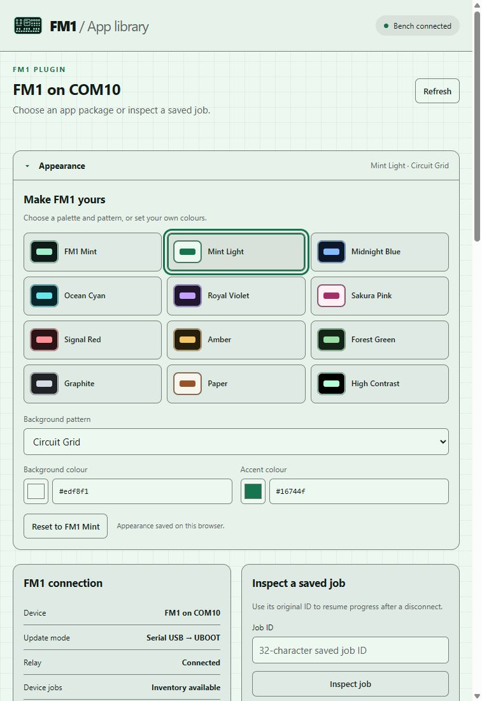
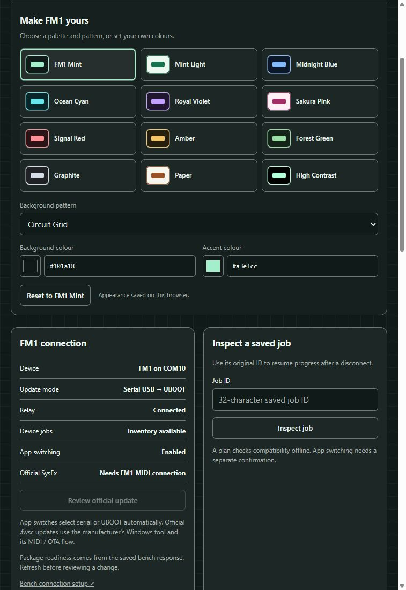
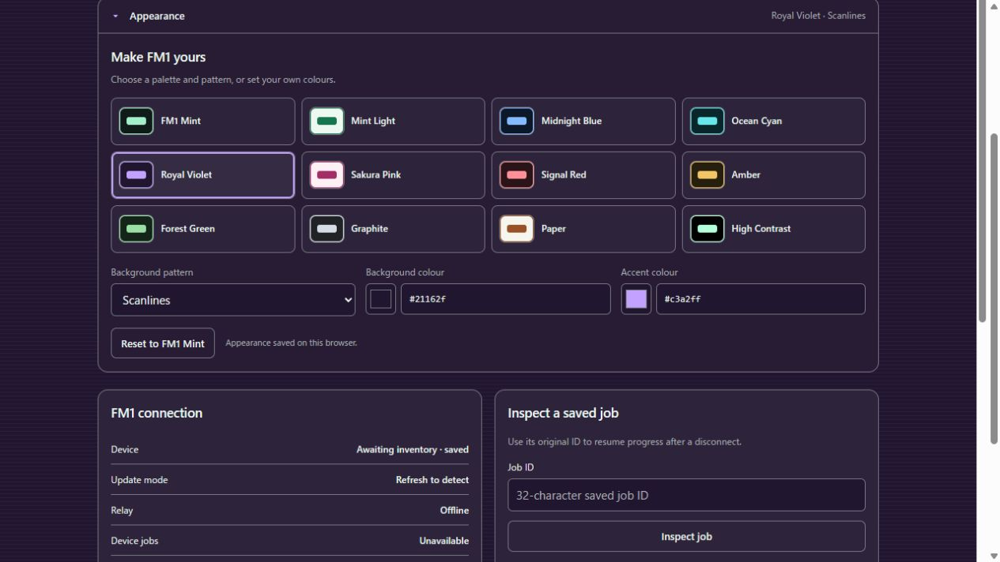
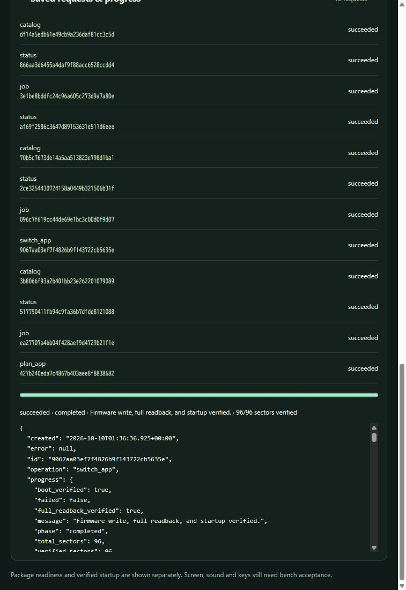
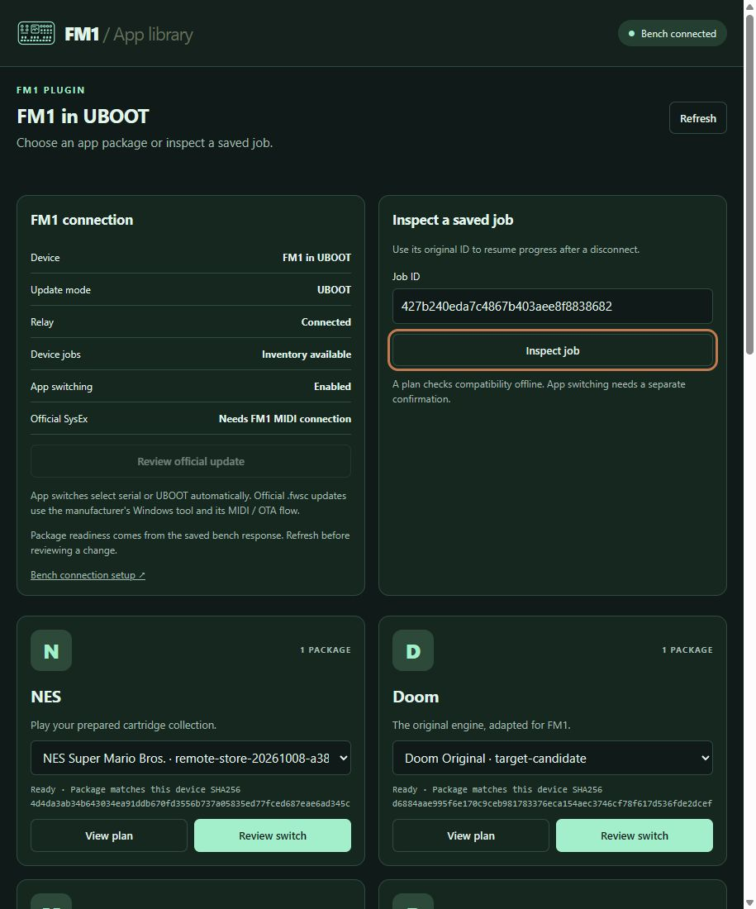
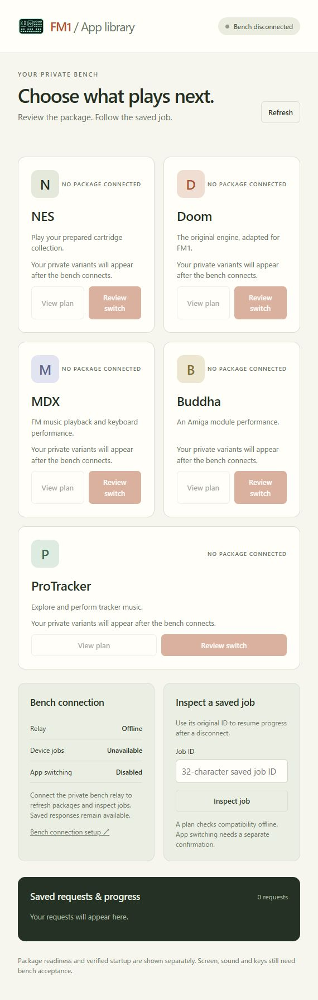
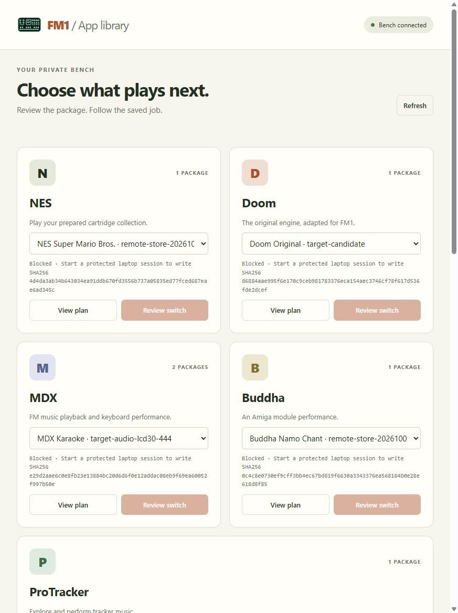
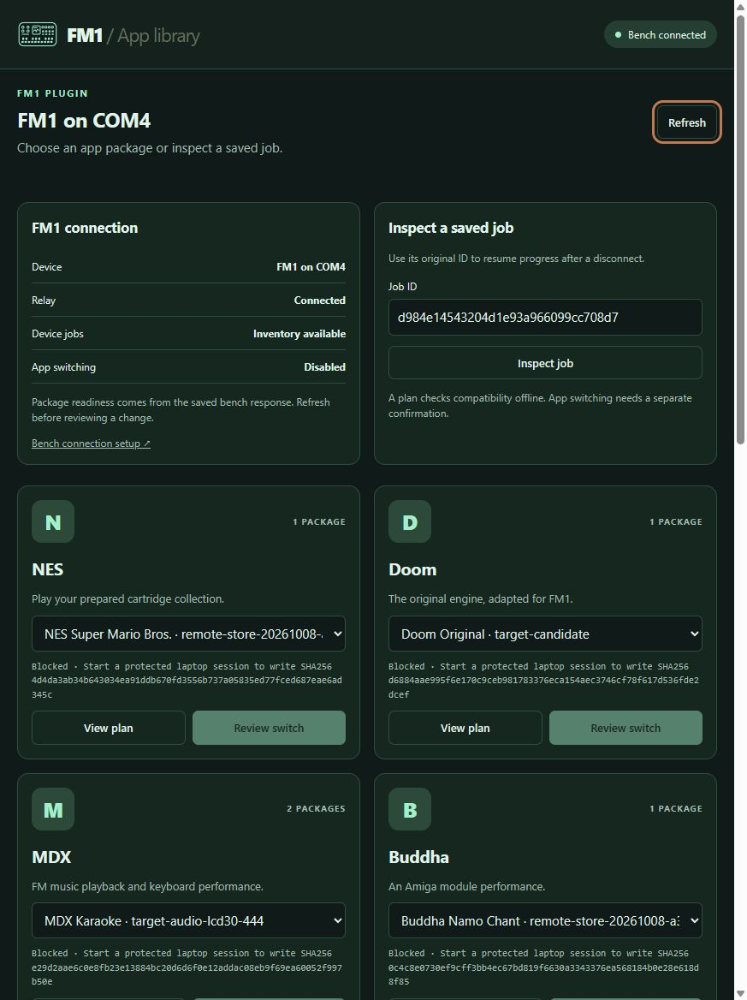

# Integration verification

## FM1 Forge final release 3.0.1, 2026-10-11

Final Site source `3e97b09eaa41515deda1401cd46d42397ee479ed` deployed privately
as `appgdep_6acb15fa58908191bf74baadb8ab0b70`; deployment succeeded with MCP
enabled. Resource `ui://fm1/forge-panel-v2.html` retains the earlier aliases.
The same private plugin ID `plugins_6ac9ad3fc1c8819195580a4747c50052` was updated
to release `pluginrel_6acb15fe4ce88191bb211830c3425552`, version **3.0.1**.
The Site URL, `/mcp` endpoint and owner-private access remain unchanged.

| Final check | Result |
|---|---|
| Full final Site test suites | Passed |
| Site typechecking | Passed |
| Site production build | Passed |
| Integration test suite | 181 tests passed |
| Primary immutable-runtime suite | 51 tests run; five skipped |
| Primary backend suite | 35 tests passed |
| Private Site publication | Succeeded; MCP enabled |
| Private plugin update | Same ID; release 3.0.1 |
| Newest native Forge card | Not yet expanded; older expanded panels remain cached App Library UI |
| New protected helper | Not started; runtime elevation canceled |
| Diagnostics transfer / candidate qualification | Not accepted; no firmware write occurred |
| Physical LCD, inputs, audio, USB and stability | Pending device tests |

The native panel defaults to opaque black/plain, retains optional appearances,
and separates fixed USB/system recovery, shared HAL and user modules. The
project configuration rejects unknown fields, unsafe folders and incompatible
presets. User text remains in text controls and host text messages. Tests cover
native messaging support/rejection, standalone copy fallback and retention of
the exact original job and uncertain transfer outcome while editing a project.
A DB-backed regression rotated 32 newer requests and retained the original
per-owner diagnostics proof, independent of the twelve visible recent requests.

Compiler evidence established the real setter as `system_clock_set`; `clk_set`
is a stub. The 320 MHz SDK table supplies a 53 MHz LSB, while the 15/30 MHz
RGB444 LCD presets require 60 MHz. The panel, Python validator and schema now
reject that combination. `sdk-320` with stock DMA and `sdk-default` with each
LCD preset remain selectable. Higher FPS and clock stability are not accepted
from compilation or offline tests.

The newest native card still needs expansion and inspection. Prior screenshots
and older expanded App Library panels do not establish final Forge rendering.
Runtime elevation was canceled, leaving no new protected helper and no writes.
Existing snapshots, receipts and saved job IDs are preserved. The diagnostics
baseline and physical tests remain separate prerequisites; no firmware
candidate or hardware qualification is claimed.

The local bridge and outbound relay were then restarted through their supported
launchers, with 53 completed/reported relay journals retained. Current bridge
PID is 154724 and relay PID is 209572. Both relay write permissions remain off;
catalog inventory recognizes all six profiles. These are metadata connections,
with no device operation requested. The old session's `stopped:false` field
reflects the absence of its stop marker; its recorded helper PID 240396 is dead.
The old verified baseline is usable for offline packaging, but that status field
alone does not establish an available protected helper.

## FM1 appearance update, 2026-10-10

Site v6 adds twelve prepared palettes and five independently selectable
patterns, plus custom background/accent RGB pickers and hexadecimal entry.
The palette engine derives readable foregrounds, surfaces, focus indicators and
button text. Preferences stay in local storage when supported; blocked storage
keeps the current panel usable and reports that the setting cannot be retained.
No appearance control calls MCP services or operates the device.

All **100 Site tests passed** (52 UI, 40 server, 4 SDK, 4 appearance engine).
These cover restored/custom/reset preferences, blocked/corrupt storage, input
validation, unchanged relay tasks, palette/custom contrast and resource aliases.
Typechecking and the production build passed. Source
`0ea345a93554ab5f65b5c2c38c77fa03a2d4e8d0` was pushed and packaged by the source
workflow. Private deployment `appgdep_6ac9a27c4a388191a7656970d906f770`
succeeded at **11:27 JST**, with MCP enabled and environment revision 1.
The server advertises `2.2.0`, resource `ui://fm1/device-panel-v6.html`, and
v1/v2/v3/v4/v5 aliases. Official SDK pins remain unchanged.

Browser QA used the actual UI in a local synthetic MCP host with device actions
disabled. It verified Mint Light/Circuit Grid, Royal Violet/Scanlines, custom
RGB/Dots, persistence after reload and reset. At a 420-pixel viewport the iframe
had equal client/scroll widths of 390 pixels, confirming no horizontal overflow.

The installed native Codex panel subsequently loaded **Appearance**, reporting
the actual FM1 on COM10. Selecting **Mint Light** and **Circuit Grid** changed
the visible UI and reported **Appearance saved on this browser**. The native
screenshot below records this selection. This resolves the earlier stale-v4
resource observation for the newly opened panel. Native custom hex colours
(`#f8f4ee` background, `#007ca8` accent) and Dots also applied, with the body
reporting custom/light and `rgb(248,244,238)`. Native reset restored FM1
Mint/Solid; the earlier FM1 Mint/Circuit Grid preference was then restored.
Persistence across reopening was verified in the synthetic host only.

A later read-only native Refresh failed with **MCP app cannot call tool outside
its trusted tool scope: open_fm1_library**. A second assistant library call had
returned **Unknown tool**, and FM1 tools are absent from the current tool
inventory. Sites still reports an active v6, no disabling authority and the
same MCP endpoint/plugin ID. Plugin metadata lookup returned 404. The cause
is unconfirmed; the loaded panel's local Appearance controls remain usable,
but current remote tool availability and native reopening are not accepted.
No firmware operation was attempted during this check. Follow-up is tracked in
[issue #6](https://github.com/Keitark/fm1-marketplace-plugin/issues/6).

## Subsequent NES programming and progress correction, 2026-10-10

The saved switch job `9067aa03ef7f4826b9f143722cb5635e` completed at
10:38 JST. Installed-tool inspection request
`096c7f619cc44de69e1bc3c00d0f9d07` returned authoritative `status:succeeded`,
`result.ok:true`, 96/96 verified sectors, `write_complete:true`,
`full_readback_verified:true` and `boot_verified:true`. Its full-image readback
SHA-256 matches NES candidate
`4d4da3ab34b643034ea91ddb670fd3556b737a05835ed77fced687eae6ad345c`.
The retained [actual switch response](evidence/fm1-nes-switch-20261010.json)
distinguishes the physical write from the earlier offline plan. Startup evidence
is serial identification and advancing counters; `physical_acceptance:false`
and the display/audio/control bench boundary remain explicit.

Fresh status request `af69f2586c3647d89153631e511d6eee` reported normal serial
mode on COM10, an idle/unblocked protected session without a running loader or
pending reset, and two succeeded jobs alongside the three retained failed plans.
No write was repeated while inspecting or correcting the UI.

The previous UI stopped after delivery succeeded, leaving the submitted job's
queued snapshot on screen. The correction follows the exact saved bridge job
with read-only inspection until its authoritative terminal state. It preserves
progress during Refresh, cancels obsolete/teardown work, bounds polling, and
stops on delivery or connection uncertainty. Missing counts do not invent a
percentage. Plans, writes and confirmations are never automatically resubmitted.
All **84 Site tests passed** (40 server, 40 UI, 4 SDK), including 15 new progress
regressions and both protocol variants with v1/v2/v3/v4 resource compatibility.

Typechecking and the production build passed. The source workflow packaged
and pushed `7c2a46dd4719db0b415a2645db65e5f7b1288a3d`; private deployment
`appgdep_6ac99af9c4f08191b1207fe174a0fa88` succeeded at 10:56 JST with MCP enabled
and environment revision 1. Site v5 advertises server version `2.1.1` and
`ui://fm1/device-panel-v5.html`, retaining v1/v2/v3/v4 aliases. SDK pins remain
server `2.3.1` and ext-apps `2.0.3`.

The newly opened native panel still loaded the prior v4 application script:
14,957 characters without `selectedWork` or `followJob`, rather than v5's
18,502-character script containing both. A separate background check of the
live Site confirmed that it serves the new 18,502-character application script
with automatic tracking and the metadata-preservation guard. Native **Inspect job** displayed the
actual NES result and 96/96 sector bar, but the old UI hid it after metadata
Refresh completed. This accepts saved-job inspection, not the v5 automatic
progress loop in the live native host. Native v5 acceptance remains pending
resource-cache refresh. OpenAI documents [UI resources as cache keys](https://developers.openai.com/plugins/build/chatgpt-ui)
and [continuous tool review and resource caching](https://developers.openai.com/plugins/deploy/app-review);
ChatGPT may retain compatible resource contents for up to an hour. Reopening
alone did not bypass the cache in this observed Codex panel.

## Initial setup update, 2026-10-10

- 189 Python tests passed in 36.368 seconds; these include 62 relay tests,
  passive mode detection, route/identity revalidation, pinned updater handoff,
  and durable recovery with the original job ID.
- 10 store JavaScript tests and 69 Site tests passed (40 server, 25 UI, 4 SDK).
  The Site tests include native confirmation, engine latches, official approval
  digest/expiry/atomicity, automatic routes and v1/v2/v3 resource aliases.
- All three integration PowerShell launchers/clients parse. Typechecking and
  the production build passed with the pinned SDKs.
- Site v4 source `bd87d14a039b8ef5233a6b3c60291c3642ee7f98` was packaged by
  the source workflow and privately deployed as
  `appgdep_6ac9903cd9e08191b5df920575373d1e`; deployment succeeded with MCP enabled.
  The installed plugin's library read succeeded after deployment.
- The separately prepared protected helper passed its live frozen-runtime
  parent/child proof. Serial identified MDX Karaoke; a guarded UBOOT transition
  and two identical complete 1 MiB readbacks completed. No flash-array program
  or erase command was sent. The readback matches the MDX RayForce catalog image
  and differs from the historical seed baseline. The source protected receipt
  and both images are preserved. The stopped source was then migrated into a
  new protected frozen-runtime session; its fresh double-read baseline and
  original evidence remain separate, with the target identity guard retained.
  After the user's power cycle, the supported serial-to-UBOOT transition passed.
  The replacement helper is idle and unblocked, without a running RAM loader or
  pending reset. The bridge and relay now use this session and retain their
  existing credentials and saved job history.
- The actual native MCP App panel renders the black/mint v4 UI. Refresh returned
  `FM1 in UBOOT`, switching enabled, and all six packages ready. NES review
  selected `auto -> already_uboot`; it was cancelled without submitting a write.
  The official updater is configured, while its review control correctly says
  `Needs FM1 MIDI connection` in this UBOOT state.
- Native `View plan` created NES job `427b240eda7c4867b403aee8f8838682`.
  `Inspect job` reused that exact ID through request
  `ea27707a4bb04f428aef9d4729b21f1e`. Both the native panel and installed plugin
  request tool returned authoritative `status:succeeded`, `result.ok:true`,
  `device_io:false`, `blocked:false`, 96 planned sectors, and the reviewed
  package SHA-256
  `4d4da3ab34b643034ea91ddb670fd3556b737a05835ed77fced687eae6ad345c`.
  Write, full-readback and boot-verification progress remained false. This
  resolves the historical missing-session plan prerequisite without claiming
  firmware programming or physical startup acceptance.
  The installed tool's saved response is retained in
  [the native plan evidence](evidence/fm1-v4-native-plan-20261010.json).
- Integration GitHub CI passed both the offline bridge/store and Site contract
  build jobs on source checkpoint `123c492` (run `38012265242`). The separate
  runtime checkpoint `47a43f2` passed 99 focused tests, including the actual
  copied interpreter and named pipes. One absent private profile fixture was
  excluded, and the full private writer fixture suite was not run.
- Generic M-UPGRADE was downloaded from the manufacturer; its executable hash
  and external `.fwsc` chooser were checked statically with its full Qt closure.
  The official MIDI/SysEx transfer and physical write/startup acceptance remain
  untested on this device. GUI handoff is never treated as verified programming.

## Historical release, 2026-10-09

The checks below were recorded on 2026-10-09 using Python 3.11.0 and
Node.js v22.22.2 on Windows. Site version 3, that release's final offline suite,
and actual native-panel acceptance are recorded below. Earlier import and
version 2 observations remain historical evidence.
Offline checks started no live bridge,
relay, protected helper, USB device, or tunnel.

| Check | Result |
|---|---|
| Current `python -m unittest discover -s tools/jieli-wl82 -p 'test_*.py'` | 150 tests passed in 35.329 seconds |
| Latest focused `python -m unittest test_site_relay` from `tools/jieli-wl82/` | 51 tests passed in 6.578 seconds |
| `node --test tools/jieli-wl82/test_remote_store.cjs` | 10 tests passed |
| PowerShell syntax parsing | All 3 scripts passed: `flash-session-client.ps1`, `start-remote-bridge.ps1`, and `start-site-relay.ps1` |
| Current `node --test site/test/*.test.mjs` | 45 tests passed: 26 server/SQLite, 15 UI, and 4 SDK tests |
| Current `node node_modules/typescript/bin/tsc --noEmit` from `site/` | Passed for the current SDK implementation |
| Current production build via installed npm CLI and `npm run build` | Passed; version 3 Cloudflare Worker output generated |
| Actual SDK Client 2.3.1 in-memory transport | Modern `2026-07-28` and legacy `2025-11-25` negotiation passed |
| Earlier synthetic browser UI verification | Passed in Codex in-app browser against a local synthetic HTTP relay; historical disconnected screenshot below |
| Private Sites deployment | Version 3 succeeded, runtime revision 1; MCP-ready |
| Installed hosted plugin tools | Library, status, catalog, and saved-job calls succeeded through the installed plugin |
| Actual native MCP App iframe | Current black/mint panel rendered; Refresh and saved-job inspection succeeded and retained the original job ID |
| Top-level WebMCP | All 6 tools passed earlier valid/malformed synthetic cases; live Site Refresh succeeded through the metadata relay |
| Authenticated live bench relay round trip | Passed for inventory, catalog, plan prerequisite failure, and saved-job inspection; switching disabled |
| Pinned official server SDK 2.3.1 + ext-apps 2.0.3 | Tests/typecheck/build/deployment passed; current native Apps SDK render and host tool calls accepted |
| Direct deployed SDK Client probe with existing relay service credential | HTTP 401; remote modern-protocol negotiation was not accepted by this probe |
| Hardware write/readback/startup and physical acceptance | Pending; no protected session/helper or physical I/O was used |

Tests use mocked device operations, synthetic data, temporary state, and
loopback HTTP. The current 150-test aggregate includes 51 outbound relay
tests plus the bridge, backend, client, and progress tests. They verify strict task/origin
validation, distinct credentials, redirect and oversized/nonfinite JSON
rejection, metadata filtering, per-state process exclusion, durable task/batch
journaling, duplicate result handling, lost submission/result recovery, and
switch enablement/digest/expiry checks. An interrupted plan/switch uses only
the original bridge job ID on recovery; it never repeats the submission.

Bridge regression coverage verifies that exceptions in offline `plan`,
`plan_app`, and `environment` requests produce `failed`, including restart
handling, while uncertain device operations retain `unknown` and their
persistent device-operation block. Transport success does not replace an
authoritative bridge job's failed/unknown status.

The 10 local-store JavaScript tests verify accessible progress, authoritative
job outcome handling, incomplete readback/startup state, and network-loss
polling without resubmission. They are source-contract tests and do not prove
native panel rendering or real WebMCP discovery.

## Historical import evidence

At the original source-snapshot verification, 97 Python tests and 10
local-store JavaScript tests passed, all 14 imported files matched the recorded
hashes/sizes, both copied PowerShell scripts parsed, and the publication scan
found no embedded private inputs or credentials. `source-snapshot.json` is
that historical import record. It is not a current hash manifest for files
changed by this integration.

The protected writer/bootstrap, private packages, and vendor USB dependencies
remain outside this repository. Python bytecode generated during verification
is ignored by Git. Local SDK and deployment acceptance remain distinct from
remote modern-protocol acceptance and hardware
acceptance.

## Published Site and browser evidence

Owner-private Site: [FM1 App Library](https://fm1-app-library.keitark.chatgpt.site).
The initial successful native deployment was `appgdep_6ac86547ba848191bf7b1e4fb6adb1ce`,
with pushed Site source `599d6ef7a7586a24c14d66181e006603e3415b5c`. The native
connection metadata reports `/mcp` as its HTTP endpoint and OAuth resource.
The plugin was subsequently installed and its open/status/catalog/job tools
were verified. Refresh worked in the actual native MCP App iframe, and live
Site WebMCP Refresh worked through the authenticated metadata relay. These
results were initially recorded before the SDK migration. After v2 deployment,
the cached v1 panel continued to work through the new server, as recorded below. The
website and MCP metadata carry
the original black/mint FM-1 mark as SVG and lossless PNG.

The local browser fixture used `/relay/heartbeat`, `/relay/poll`, and
`/relay/result`, exercising the real Worker/D1 routes without importing a
bridge or device backend. Valid calls displayed synthetic catalog, plan and
saved-job progress. Switch review returned no approval nonce, Cancel closed
the dialog, and a local readback counted zero `switch_app` tasks. The VM tests
separately verify untrusted-click rejection and one-use trusted confirmation.
See [WEBMCP.md](WEBMCP.md) for the exact boundary and repeatable fixture.

The historical local screenshot uses an empty, disconnected database after fixture
cleanup. No test credentials, production relay token, or local mock identity
were embedded in the production Worker. Runtime secrets are held in Sites;
owner-only credential files remain outside Git. No live bench relay was
started during those fixture checks. The subsequent live metadata connection
is recorded separately below.

## Verified live metadata connection

The supported local bridge was observed as PID **134988** on loopback port
**9770**, launched without `SessionRoot` or an official updater. The relay was
observed as PID **411680**, with switching disabled. These process IDs are
dated observations; future operations must inspect the actual current process.
Inventory reported COM4 and CDC/audio interfaces. The catalog contained six
validated private packages, all `ready:false` because no verified protected
session/baseline was configured.

The MDX plan request and bridge job
`d984e14543204d1e93a966099cc708d7` had successful delivery and authoritative
bridge status `failed`, with **Start a protected session on the laptop first**.
Saved-job inspection used delivery request
`68060f826e704d2d8075321d4461577d` and confirmed that original outcome. No device
I/O or protected-helper creation occurred. A successful transport result is
not a successful plan or hardware operation.

The older snapshot worker is stopped and lacks the required remote-read
guard. The remote laptop is offline. Neither is current evidence of a usable
local protected session; no frozen helper was replaced or reactivated.

## Historical version 2 deployment and acceptance boundaries

Version **2** pins official server SDK **2.3.1** and native-panel **ext-apps
2.0.3**. Its **41 tests** (25 server, 12 UI, 4 SDK), type check, and production
build passed. Actual SDK Client 2.3.1 passed in-memory modern **2026-07-28** and
legacy **2025-11-25** protocol negotiation. The earlier 36-test Site result is
historical; the 41-test suite was that version's offline record. These client
tests do not establish remote modern negotiation.

Native deployment `appgdep_6ac8f089484881919b4e10b89ef4f608` succeeded as Site
version **2**, runtime revision **1**, with MCP-ready status. Source SHA:
`5d32bd0c023d4a3d7ef77fb454164844131a29d0`. The new UI resource is
`ui://fm1/device-panel-v2.html`.

After v2 deployment, the cached v1 native panel successfully refreshed
inventory with request `f5384b7e6f9e41e8b29073a3e93daed4` and catalog with
request `7cd30350d95d4cb6b780586043649cf6`. It still reported COM4 and six
blocked packages. Saved-job inspection delivery
`6767e0f9833d4826a480b12210aa09e0` preserved the original bridge job
`d984e14543204d1e93a966099cc708d7` and its `failed` protected-session prerequisite
outcome. No device I/O or protected session/helper creation occurred.

During version 2 acceptance, newly opened panels retained **Choose what plays
next.** and the older tool title. Version 3 compatibility resources resolved
that stale UI; current rendering and host calls are recorded below.

A direct deployed SDK Client probe using the existing relay service credential
returned **HTTP 401**. It did not establish modern remote protocol negotiation.
No raw secrets or private physical identifiers were persisted. Physical
write/readback/startup, screen, audio, and controls remain unaccepted.

## Current version 3 deployment and native acceptance

Owner-private version **3** deployed successfully as
`appgdep_6ac8fc0660648191a2521acd37271e3c`, runtime revision **1**, MCP-ready.
Its pushed source is `0e76fa6923d74ca96f71312a77d033b4c4935723`.
The current descriptor uses `ui://fm1/device-panel-v3.html`; the earlier
`ui://fm1/app-library-v1.html` and `ui://fm1/device-panel-v2.html` also return
the current UI. Modern and legacy SDK tests verify identical content and CSP
for all three resources.

The actual Codex native MCP App now renders the black/mint **FM1 plugin**
panel with **FM1 on COM4**. This supersedes the earlier stale-rendering blocker.
The read-only app-server `app/installed` refresh reported FM1 installed,
enabled and callable; `app/list` refetch and `app/read` reported the new
**FM1 device panel** tool title. The existing native tab title still reflects
the older registration; compatibility resource reads made its UI current.
No plugin uninstall/reinstall or replacement app was used.

Native **Refresh** succeeded with status request
`f8fcd7c963f64b2caf8ee67aa89114a5` and catalog request
`3b61f8abdef742f6a7f9bd196819e821`, retaining the original bridge job ID in
the recovery field. The relay was then restarted from the updated source,
preserving its existing state/configuration/credential files, with switching
disabled. Its new observed PID is **422648**; bridge PID **134988** was not
restarted or reconfigured. No unfinished relay deliveries existed at the
restart check.

The updated relay delivered native saved-job inspection
`2e5b770a13ed49c69ba90f18bdca17ea`, preserving original bridge job
`d984e14543204d1e93a966099cc708d7` and its authoritative `failed` outcome:
**Start a protected session on the laptop first**. A further native Refresh
succeeded with status `7107aa1ea63c491ebdf8f2ce208f9fab` and catalog
`81b6d583e38c4c1cae5a8053ad488299`. The job ID remained unchanged, the
panel showed five app cards/six package variants, and no UI error appeared.

Final offline checks passed **150 Python tests** (including **51 relay**),
**10 local-store JavaScript tests**, and **45 Site tests** (26 server, 15 UI,
4 SDK), plus typechecking and the production build. New coverage includes:

- Exact 65,536-byte request acceptance and 65,537-byte rejection for headerless
  multibyte JSON, without committing the rejected result.
- Metadata compaction that preserves authoritative outcome/progress and keeps
  later relay tasks moving under actual Site request/result limits.
- Legacy journals above 64 KiB, including already-reported records, startup,
  explicit size rejection and accepted-result ACK loss without another bridge POST.
- Immutable replay after timeout/conflict; only definite size rejection permits
  an atomically persisted compact replacement before retry.
- Saved job ID retention across refresh/inspection and confirmation reply loss,
  with inspection of the exact committed ID and no duplicate switch submission.

The protected session and verified unit-specific baseline remain external
bench prerequisites. All six packages remain `ready:false`; switching is
disabled. These checks performed no device I/O, helper creation, firmware
write, readback, reset or physical acceptance. Standalone remote modern
protocol negotiation remains unverified by the earlier service-token probe;
current native Apps SDK rendering and tool calls are verified separately.
